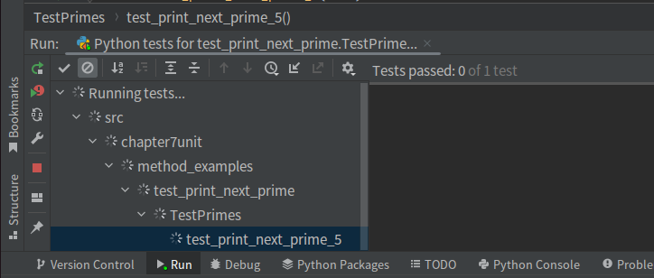
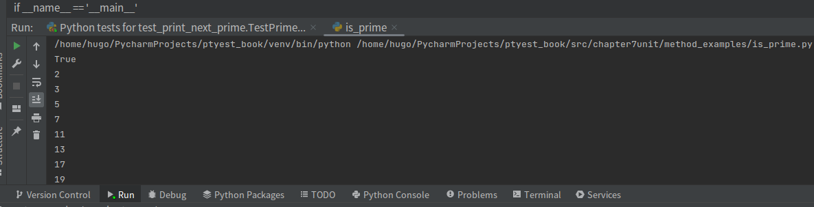

## 单元测试

单元测试的英文是Unit Testing,特指在一个分隔的代码单元中进行的测试，一个单元可以是整个模块，一个单独的类或者函数。

编写单元测试的代码可以帮助我们在早期快速找到bug，以较小的代价在早期找到bug。

## 被测函数

我们先编写一个函数，判断输入数据是否是素数，并且可以判断距离这个数最近的素数。


```python
.
# Author: chenjunllin
# Date: 2022-03-16 
# File: is_prime.py


def is_prime(number):
    """如果是质数，返回为True"""
    for element in range(2, number):
        if number % element == 0:
            return False
    return True


def print_next_prime(number):
    """打印输入number数字最近的质数"""
    index = number
    while True:
        index += 1
        if is_prime(index):
            print(index)
```

## 测试is_prime函数

使用测试驱动开发(TDD)的方法，编写的最简单的测试代码测试is_prime函数是否实现了功能，代码如下：

```python

# Author: chenjunlin
# Date: 2023-03-16
# File: test_is_prime.py

import pytest

from src.chapter7unit.method_examples.is_prime import is_prime


class TestPrimes(object):
    """测试is_prime"""

    def test_is_zero_not_prime(self):
        """测试边界值0是不是质数"""
        assert is_prime(0) is False

    def test_is_one_not_prime(self):
        """测试边界值1是不是质数"""
        assert is_prime(1) is False

    def test_is_two_prime(self):
        """2是质数"""
        assert is_prime(2) is True

    def test_is_four_non_prime(self):
        """4不是质数"""
        assert is_prime(4) is False

    def test_is_five_prime(self):
        """5是不是质数？"""
        assert is_prime(5) is True


if __name__ == '__main__':
    pytest.main()

```

输出结果如下：

也就是说，0和1不是素数，但是函数返回的结果是1，说明is_prime函数没有实现功能。


回到原来的函数，发现是因为range函数的范围是从2到number，所以0和1都没有被判断，所以我们修改一下代码，如下：

```python
def is_prime(number):
    """如果是质数，返回为True"""
    if number < 2:
        return False
    for element in range(2, number):
        if number % element == 0:
            return False
    return True
```

再次运行test_is_prime.py测试代码，发现测试通过了。


## 测试print_next_prime函数

我们再来编写一个测试函数，测试print_next_prime函数，代码如下：

```python
# Author: chenjunlin
# Date: 2023-03-16
# File: test_print_is_prime.py

import pytest

from src.chapter7unit.method_examples.is_prime import print_next_prime

class TestPrimes(object):
    """测试print_next_prime"""

    def test_print_next_prime_0(self):
        """ 0的最近质数是2 """
        assert print_next_prime(0) is 2

    def test_print_next_prime_4(self):
        """ 4的最近质数是5 """
        assert print_next_prime(4) is 5

    def test_print_next_prime_5(self):
        """ 5的最近质数是7 """
        assert print_next_prime(5) is 7

    def test_print_next_prime_7(self):
        """ 7的最近质数是11 """
        assert print_next_prime(7) is 11


if __name__ == '__main__':
    pytest.main()
```

没有通过测试，结果如下：




原来是因为print_next_prime函数返回结果并不是距离输入数字最近的素数，而是返回了所有大于输入数字的素数，所以在running tests中，我们可以发现一直在打转，没有返回assert断言的结果。

我们还可以通过在is_prime.py中添加魔术方法__name__ == '__main__'来测试print_next_prime函数，代码如下：

```python
if __name__ == '__main__':

    print(is_prime(2))
    print_next_prime(0)

```

发现结果确实是打印了所有大于输入数字的素数：




我们修改一下代码，如下：

```python
def print_next_prime2(number):
    """打印输入number数字最近的质数"""
    index = number
    while True:
        index += 1
        if is_prime(index):
            return index
```

再次运行测试代码，发现测试通过了。


